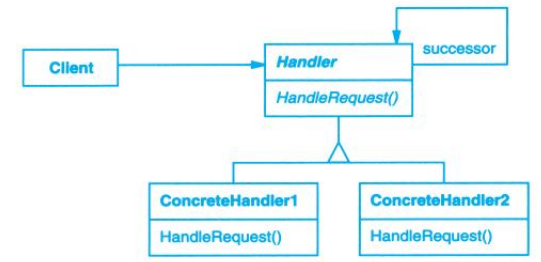

# Chain of Responsibility (职责链)

## Description (介绍)

Avoid coupling the sender of a request to its receiver by giving more than one object a chance to handle the request. Chain the receiving objects and pass the request along the chain until an object handles it.   
使多个对象都有机会处理请求，从而避免请求的发送者和接收者之间的耦合关系。将这些对象连成一条链，并沿着这条链传递该请求，直到有一个对象处理它为止。

### When to Use (适用性)

- more than one object may handle a request, and the handler isn't known a priori. The handler should be ascertained automatically.  
有多个对象可以处理一个请求，哪个对象处理该请求运行时自动确定。
- you want to issue a request to one of several objects without specifying the receiver explicitly.  
你想在不明确指定接收者的情况下，向多个对象中的一个提交一个请求。
- the set of objects that can handle a request should be specified dynamically.  
可处理一个请求的对象集合应被动态指定。

## Structure (结构)

