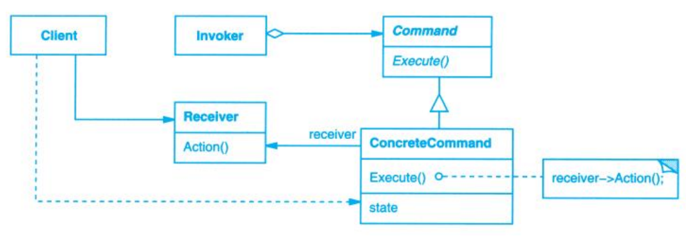

# Command (命令)

## Description (介绍)

Encapsulate a request as an object, thereby letting you parameterize clients with different requests, queue or log requests, and support undoable operations.   
将一个请求封装为一个对象，从而使你可用不同的请求对客户进行参数化，对请求排队或记录请求日志，以及支持可撤销的操作。

### When to Use (适用性)

- parameterize objects by an action to perform.  
抽象出待执行的动作以参数化某对象。
- specify, queue, and execute requests at different times.  
在不同的时刻指定、排列和执行请求。
- support undo.  
支持取消操作。
- support logging changes so that they can be reapplied in case of a system crash.  
支持修改日志，这样当系统崩溃时，这些修改可以被重做一遍。
- structure a system around high-level operations built on primitives operations.  
用构建在原语操作上的高层操作构造一个系统。

## Structure (结构)

