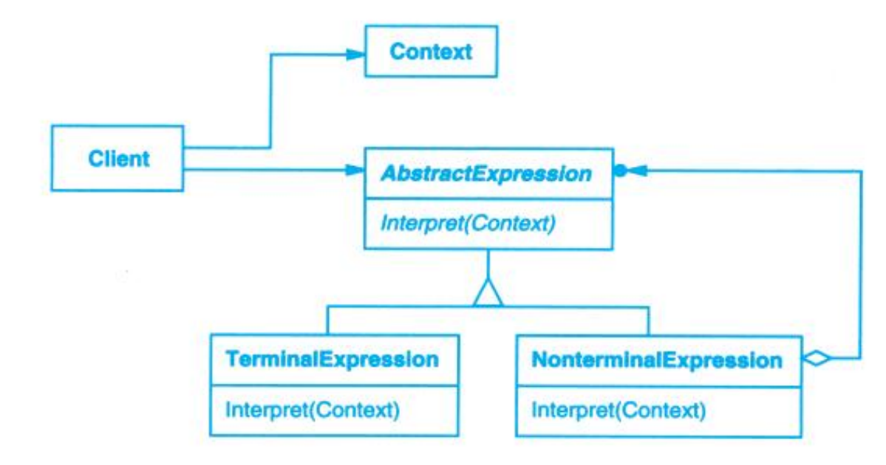

# Interpreter (解释器)

## Description (介绍)

Given a language, define a represention for its grammar along with an interpreter that uses the representation to interpret sentences in the language.   
给定一个语言，定义它的文法的一种表示，并定义一个解释器，这个解释器使用该表示来解释语言中的句子。

### When to Use (适用性)

Use the Interpreter pattern when there is a language to interpret, and you can represent statements in the language as abstract syntax trees. The Interpreter pattern works best when  
当有一个语言需要解释执行，并且你可将该语言中的句子表示为一个抽象语法树时，可使用解释器模式。而当存在以下情况时该模式效果最好：

- the grammar is simple.  
文法简单。
- efficiency is not a critical concern.  
效率不是关键问题。

## Structure (结构)

