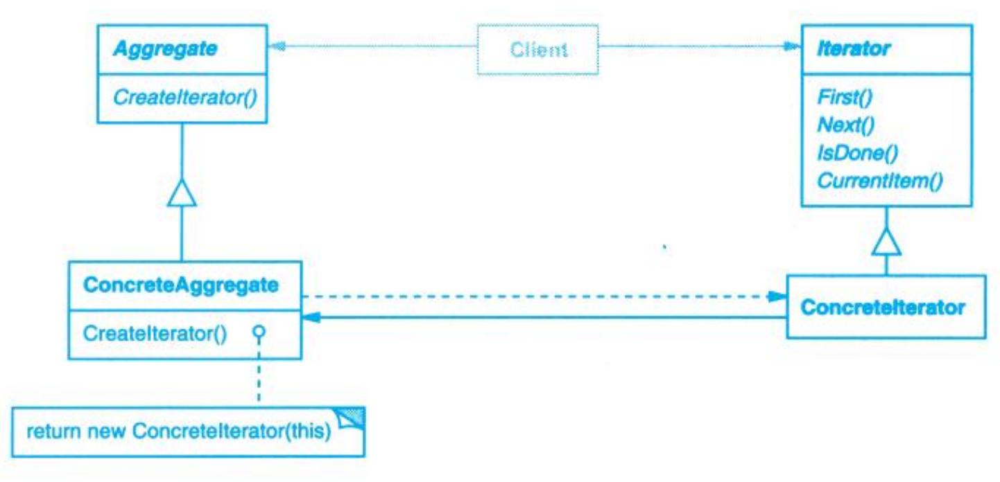

# Iterator (迭代器)

## Description (介绍)

Provide a way to access the elements of an aggregate object sequentially without exposing its underlying representation.   
提供一种方法顺序访问一个聚合对象中的各个元素，而又不需要暴露该对象的内部表示。

### When to Use (适用性)

- to access an aggregate object's contents without exposing its internal representation.  
访问一个聚合对象的内容而无须暴露它的内部表示。
- to support multiple traversals of aggregate objects.  
支持对聚合对象的多种遍历。
- to provide a uniform interface for traversing different aggregate structures (that is, to support polymorphic iteration).  
为遍历不同的聚合结构提供一个统一的接口（即支持多态迭代）。

## Structure (结构)

