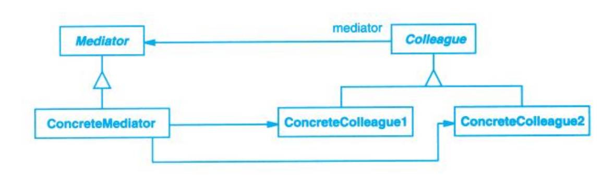

# Mediator (中介者)

## Description (介绍)

Define an object that encapsulates how a set of objects interact. Mediator promotes loose coupling by keeping objects from referring to each other explicitly, and it lets you vary their interaction independently.   
用一个中介对象来封装一系列的对象交互。中介者使各对象不需要显式地相互引用，从而使其耦合松散，而且可以独立地改变它们之间的交互。

### When to Use (适用性)

- a set of objects communicate in well-defined but complex ways. The resulting interdependencies are unstructured and difficult to understand.  
一组对象以定义良好但复杂的方式进行通信，产生的相互依赖关系结构混乱且难以理解。
- reusing an object is difficult because it refers to and communicates with many other objects.  
一个对象引用其他很多对象并且直接与这些对象通信，导致难以复用该对象。
- a behavior that's distributed between several classes should be customizable without a lot of subclassing.  
想定制一个分布在多个类中的行为，而又不想生成太多的子类。

## Structure (结构)

