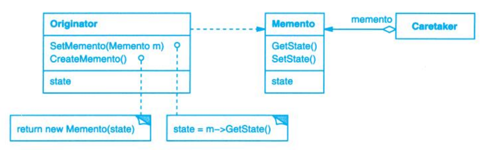

# Memento (备忘录)

## Description (介绍)

Without violating encapsulation, capture and externalize an object's internal state so that the object can be restored to this state later.   
在不破坏封装性的前提下，捕获一个对象的内部状态，并在该对象之外保存这个状态。这样以后就可将该对象恢复到原先保存的状态。

### When to Use (适用性)

- a snapshot of (some portion of) an object's state must be saved so that it can be restored to that state later.  
必须保存一个对象在某个时刻的（部分）状态，这样以后需要时它才能恢复到先前的状态。
- a direct interface to obtaining the state would expose implementation details and break the object's encapsulation.  
如果一个接口让其他对象直接得到这些状态，将会暴露对象的实现细节并破坏对象的封装性。

## Structure (结构)

