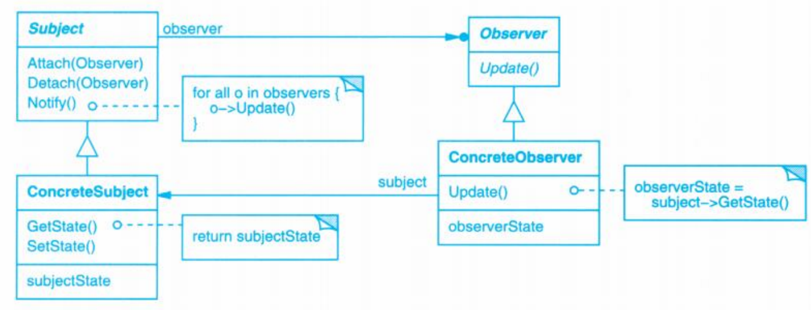

# Observer (观察者)

## Description (介绍)

Define a one-to-many dependency between objects so that when one object changes state, all its dependents are notified and updated automatically.   
定义对象间的一种一对多的依赖关系，当一个对象的状态发生改变时，所有依赖于它的对象都得到通知并被自动更新。

### When to Use (适用性)

- When an abstraction has two aspects, one dependent on the other. Encapsulating these aspects in separate objects lets you vary and reuse them independently.  
一个抽象模型有两个方面，其中一个方面依赖于另一方面。将这二者封装在独立的对象中，以使它们可以各自独立地改变和复用。
- When a change to one object requires changing others, and you don't know how many objects need to be changed.  
对一个对象的改变需要同时改变其他对象，而不知道具体有多少对象有待改变。
- When an object should be able to notify other objects without making assumptions about who these objects are. In other words, you don't want these objects tightly coupled.  
一个对象必须通知其他对象，而它又不能假定其他对象是谁。换言之，你不希望这些对象是紧密耦合的。

## Structure (结构)

