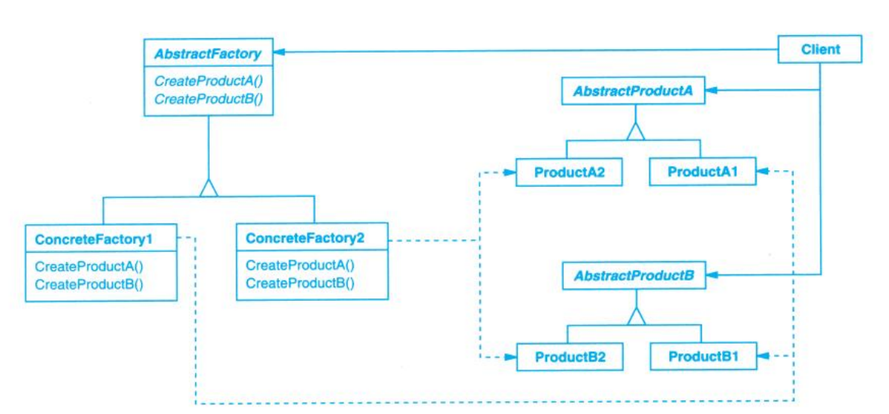

# Abstract Factory (抽象工厂)

## Description (介绍)

Provides an interface for creating families of related or dependent objects without specifying their concrete classes.  
提供一个接口以创建一系列相关或相互依赖的对象，而无须指定它们具体的类。

### When to Use (适用性)

- The system should be independent of how its products are created, composed, and represented.  
一个系统要独立于它的产品的创建、组合和表示。
- The system should be configured with one of multiple families of products.  
一个系统要由多个产品系列中的一个来配置。
- A family of related product objects is designed to be used together.  
要强调一系列相关的产品对象的设计以便进行联合使用。
- You want to provide a class library of products, exposing only their interfaces, not their implementations.  
提供一个产品类库，但只想显示它们的接口而不是实现。

## Structure (结构)

