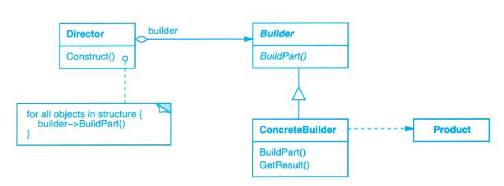

# Builder (生成器)

## Description (介绍)

Separates the construction of a complex object from its representation so that the same construction process can create different representations.   
将一个复杂对象的构建与它的表示分离，使得同样的构建过程可以创建不同的表示。

### When to Use (适用性)

- the algorithm for creating a object should be independent of the parts and how they're assembled  
当创建复杂对象的算法应该独立于该对象的组成部分以及它们的装配方式时。
- the construction process must allow different representations for the object that's constructed  
当构造过程必须允许被构造的对象有不同的表示时。

## Structure (结构)

