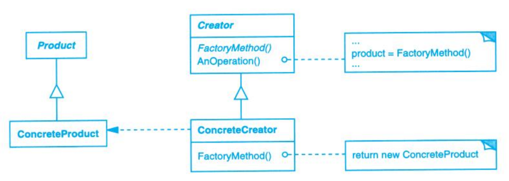

# Factory Method (工厂方法)

## Description (介绍)

Define an interface for creating an object, but let subclasses decide which class to instantiate. Factory Method lets a class defer instantiation to subclasses.   
定义一个用于创建对象的接口，让子类决定实例化哪一个类。Factory Method使一个类的实例化延迟到其子类。

### When to Use (适用性)

- a class can't anticipate the class of objects it must create.  
当一个类不知道它所必须创建的对象的类的时候。
- a class wants its subclasses to specify the objects it creates.  
当一个类希望由它的子类来指定它所创建的对象的时候。
- classes delegate responsibility to one of several helper subclasses, and you want to localize the knowledge of which helper subclass is the delegate.  
当类将创建对象的职责委托给多个帮助子类中的某一个，并且你希望将哪一个帮助子类是代理者这一信息局部化的时候。

## Structure (结构)

