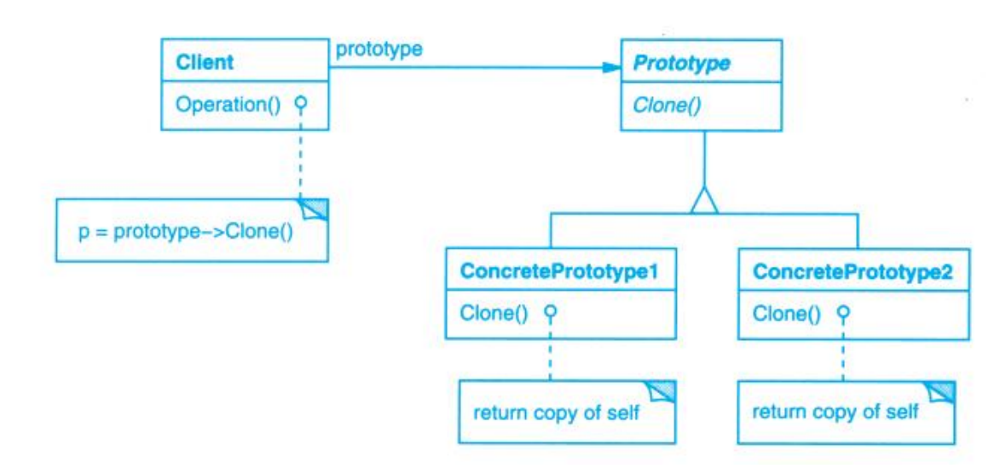

# Prototype (原型)

## Description (介绍)

Specify the kinds of objects to create using a prototypical instance, and create new objects by copying this prototype.   
用原型实例指定创建对象的种类，并且通过拷贝这些原型创建新的对象。

### When to Use (适用性)

- The system should be independent of how its products are created, composed, and represented.  
当一个系统要独立于它的产品的创建、组合和表示。
- when the classes to instantiate are specified at run-time.  
当要实例化的类是在运行时指定时，例如，通过动态装载。
- to avoid building a class hierarchy of factories that parallels the class hierarchy of products.  
为了避免创建一个与产品类层次平行的工厂类层次时。
- when instances of a class can have one of only a few different combinations of state.  
当一个类的实例只能有几个不同状态组合中的一种时。

## Structure (结构)

