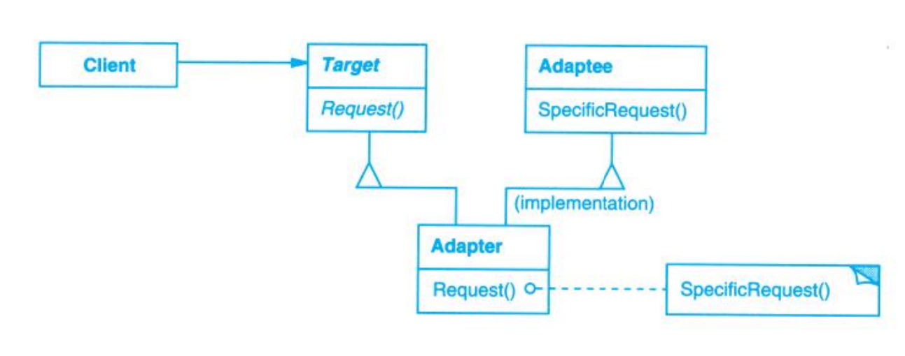
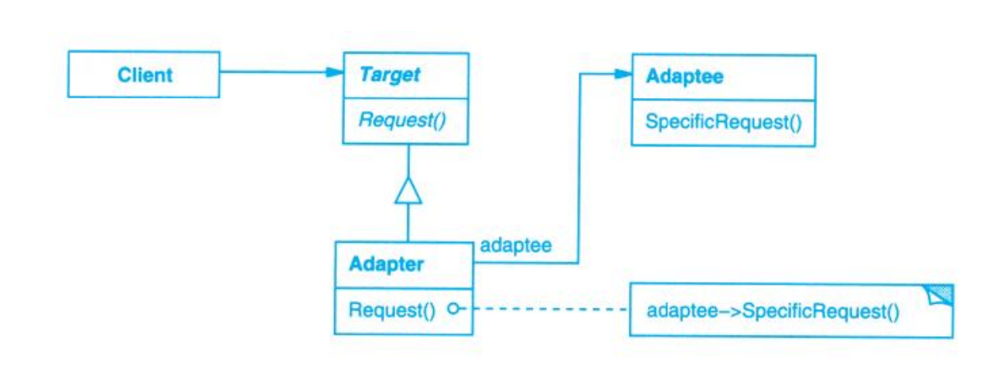

# Adapter (适配器)

## Description (介绍)

Convert the interface of a class into another interface the clients expect. Adapter lets classes work together that couldn't otherwise because of incompatible interfaces.   
将一个类的接口转换成客户希望的另外一个接口。Adapter模式使得原本由于接口不兼容而不能一起工作的那些类可以一起工作。

### When to Use (适用性)

- you want to use an existing class, and its interface does not match the one you need.  
你想使用一个已经存在的类，而它的接口不符合你的需求。
- you want to create a reusable class that cooperates with classes that don't necessarily have compatible interfaces  
你想创建一个可以复用的类，该类可以与其他不相关的类或不可预见的类（即那些接口可能不一定兼容的类）协同工作。

## Structure (结构)

