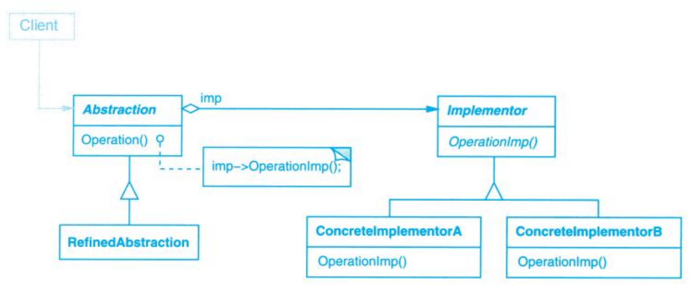

# Bridge (桥接)

## Description (介绍)

Decouple an abstraction from its implementation so that the two can vary independently.   
将抽象部分与它的实现部分分离，使它们可以独立地变化。

### When to Use (适用性)

- you want to avoid a permanent binding between an abstraction and its implementation. This might be the case, for example, when the implementation must be selected or switched at run-time.  
你不希望在抽象和它的实现部分之间有一个固定的绑定关系。例如，这种情况可能是因为，在程序运行时实现部分应可以被选择或者切换。
- both the abstractions and their implementations should be extensible by subclassing. In this case, the Bridge pattern lets you combine the different abstractions and implementations and extend them independently.  
类的抽象以及它的实现都应该可以通过生成子类的方法加以扩充。这时Bridge模式使你可以对不同的抽象接口和实现部分进行组合，并分别对它们进行扩充。
- changes in the implementation of an abstraction should have no impact on clients; that is, their code should not have to be recompiled.  
对一个抽象的实现部分的修改应对客户不产生影响，即客户的代码不必重新编译。
- (C++) you want to hide the implementation of an abstraction completely from clients. In C++ the representation of a class is visible in the class interface.  
（C++）你想对客户完全隐藏抽象的实现部分。在C++中，类的表示在类接口中是可见的。

## Structure (结构)

