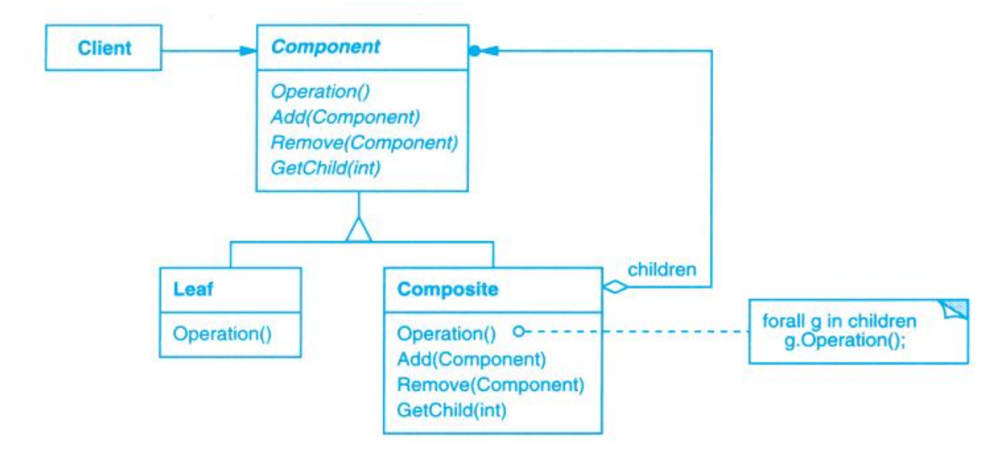

# Composite (组合)

## Description (介绍)

Compose objects into tree structures to represent part-whole hierarchies. Composite lets clients treat individual objects and compositions of objects uniformly.   
将对象组合成树形结构以表示“部分–整体”的层次结构。Composite使得用户对单个对象和组合对象的使用具有一致性。

### When to Use (适用性)

- you want to represent part-whole hierarchies of objects.  
你想表示对象的部分–整体层次结构。
- you want clients to be able to ignore the difference between compositions of objects and individual objects. Clients will treat all objects in the composite structure uniformly.  
你希望用户忽略组合对象与单个对象的不同，用户将统一地使用组合结构中的所有对象。

## Structure (结构)

