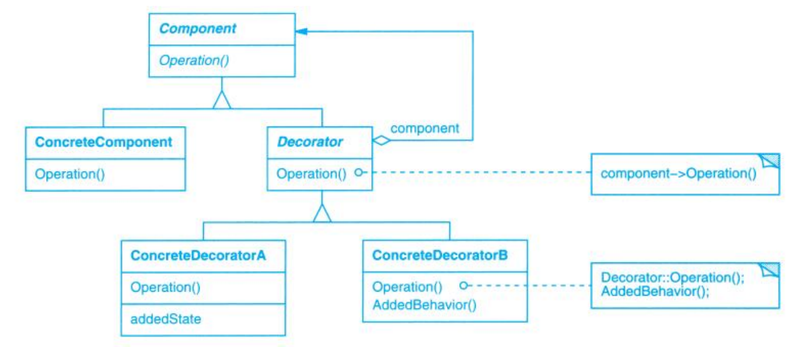

# Decorator (装饰)

## Description (介绍)

Attach additional responsibilities to an object dynamically. Decorators provide a flexible alternative to subclassing for extending functionality.   
动态地给一个对象添加一些额外的职责。就增加功能来说，Decorator模式相比生成子类更为灵活。

### When to Use (适用性)

- to add responsibilities to individual objects dynamically and transparently, that is, without affecting other objects.  
在不影响其他对象的情况下，以动态、透明的方式给单个对象添加职责。
- for responsibilities that can be withdrawn.  
处理那些可以撤销的职责。
- when extension by subclassing is impractical. Sometimes a large number of independent extensions are possible and would produce an explosion of subclasses to support every combination. Or a class definition may be hidden or otherwise unavailable for subclassing.  
当不能采用生成子类的方法进行扩充时。一种情况是，可能有大量独立的扩展，为支持每一种组合将产生大量的子类，使得子类数目
呈爆炸性增长。另一种情况可能是，类定义被隐藏，或类定义不能用于生成子类。。

## Structure (结构)

