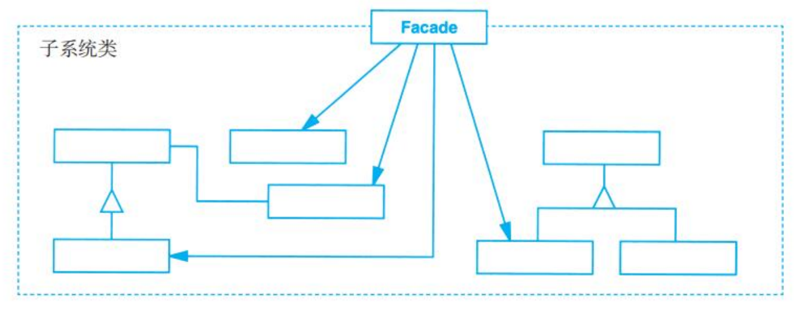

# Facade (外观)

## Description (介绍)

Provide a unified interface to a set of interfaces in a subsystem. Facade defines a higher-level interface that makes the subsystem easier to use.   
为子系统中的一组接口提供一个一致的界面，Facade模式定义了一个高层接口，这个接口使得这一子系统更加容易使用。

### When to Use (适用性)

- you want to provide a simple interface to a complex subsystem.  
当你要为一个复杂子系统提供一个简单接口时。
- there are many dependencies between clients and the implementation classes of an abstraction.  
客户程序与抽象类的实现部分之间存在着很大的依赖性。
- you want to layer your subsystems. Use a facade to define an entry point to each subsystem level.  
当你需要构建一个层次结构的子系统时，使用Facade模式定义子系统中每层的入口点。

## Structure (结构)

