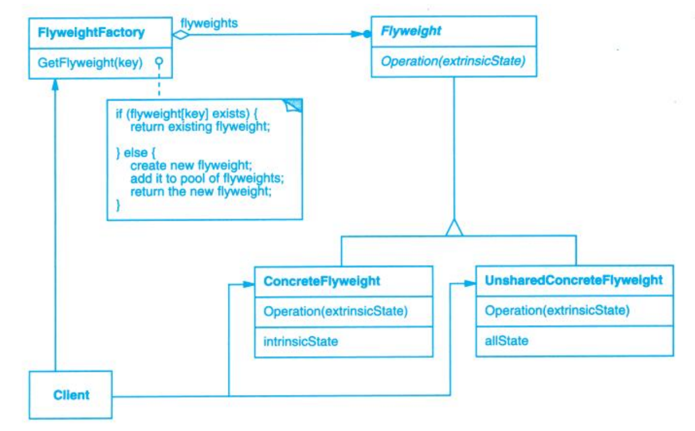
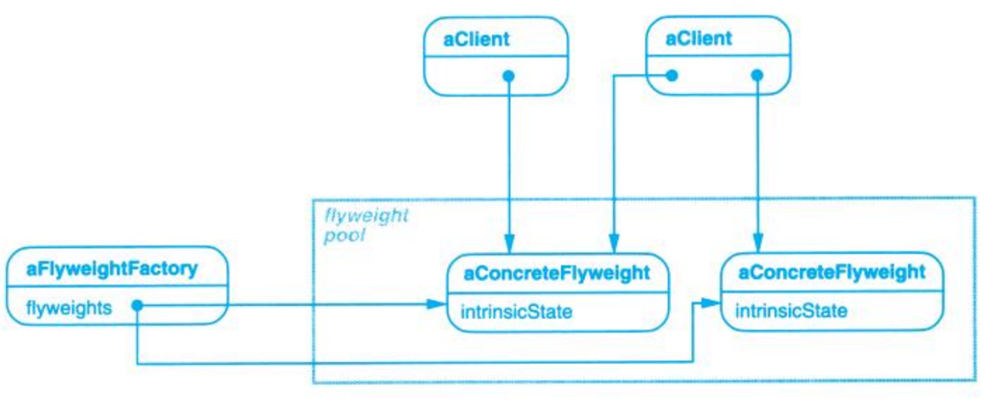

# Flyweight (享元)

## Description (介绍)

Use sharing to support large numbers of fine-grained objects efficiently.   
运用共享技术有效地支持大量细粒度的对象。

### When to Use (适用性)

- An application uses a large number of objects.  
一个应用程序使用了大量的对象。
- Storage costs are high because of the sheer quantity of objects.  
完全由于使用大量的对象造成很大的存储开销。
Most object state can be made extrinsic.  
对象的大多数状态都可变为外部状态。
- Many groups of objects may be replaced by relatively few shared objects once extrinsic state is removed.  
如果删除对象的外部状态，那么可以用相对较少的共享对象取代很多组对象。
- The application doesn't depend on object identity.  
应用程序不依赖于对象标识。

## Structure (结构)

