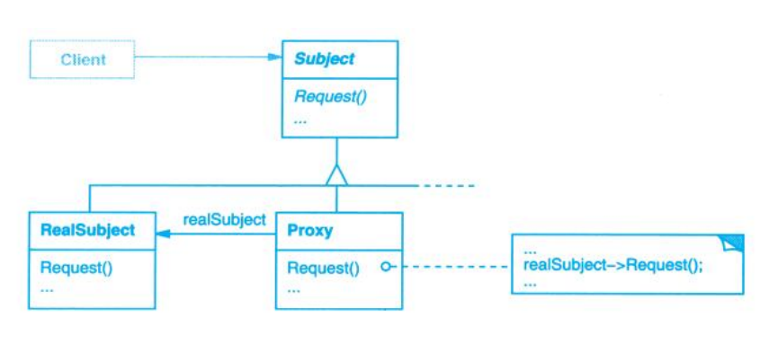

# Proxy (代理)

## Description (介绍)

Provide a surrogate or placeholder for another object to control access to it.   
为其他对象提供一种代理以控制对这个对象的访问。

### When to Use (适用性)

- Proxy is applicable whenever there is a need for a more versatile or sophisticated reference to an object than a simple pointer.  
在需要用比较通用和复杂的对象指针代替简单的指针的时候，使用Proxy模式。
  - A remote proxy provides a local representative for an object in a different address space.  
  远程代理为一个对象在不同的地址空间提供局部代表。
  - A virtual proxy creates expensive objects on demand.  
  虚代理根据需要创建开销很大的对象。
  - A protection proxy controls access to the original object.  
  保护代理控制对原始对象的访问。
  - A smart reference is a replacement for a bare pointer that performs additional actions when an object is accessed.  
  智能指引取代了简单的指针，它在访问对象时执行一些附加操作。

## Structure (结构)

